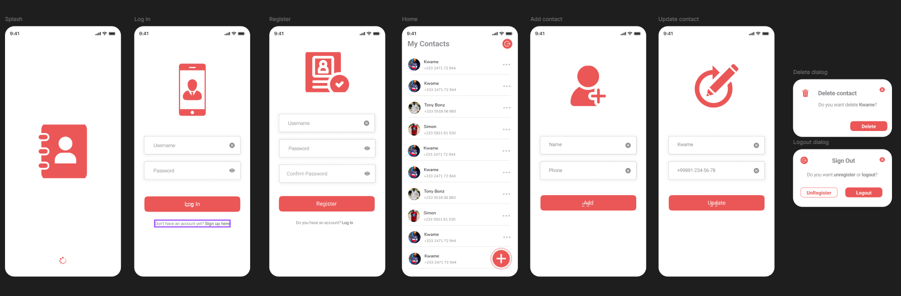

# 📱 Contact Manager App

A modern, high-performance Flutter application designed for seamless contact management. Built utilizing a clean, scalable architectural pattern to ensure robust state management and separation of concerns.



---

## 🚀 Key Features

* **Complete CRUD Operations**: Create, read, update, and delete contacts effortlessly.
* **Persistent Local Storage**: Secure, on-device data caching utilizing standard key-value preferences.
* **Streamlined UI/UX**: Responsive multi-screen design optimized for both phone and landscape orientations.
* **Clean Architecture**: Decoupled presentation, data, and business logic layers for easier testing and maintenance.

---

## 🛠️ Architecture & Project Structure

The project strictly adheres to **Clean Architecture** principles to separate core business logic from UI elements and data sources:

```text
lib/
├── data/
│   ├── source/
│   │   └── local/           # Shared preferences & embedded local databases
│   └── model/               # Data transfer objects (DTOs) & entity definitions
├── presentation/
│   ├── screens/             # UI Views (Login, Home, Registration, Details)
│   └── widgets/             # Reusable UI components across views
└── main.dart                # Application initialization and dependency injection
```

---

## ⚙️ Getting Started

### Prerequisites

Ensure you have the following environment configurations:
* Flutter SDK (Latest Stable Version)
* Android Studio / VS Code with Flutter extensions installed

### Installation & Run

1. **Clone the repository**
   ```bash
   git clone https://github.com
   cd contact_app
   ```

2. **Install project dependencies**
   ```bash
   flutter pub get
   ```

3. **Launch the application**
   ```bash
   flutter run
   ```

---

## 📦 Core Dependencies

* `flutter_lints` - Enforces community-standard code analysis rules.
* *(Add any other key state management or package names here, e.g., Provider, Bloc, Hive)*
